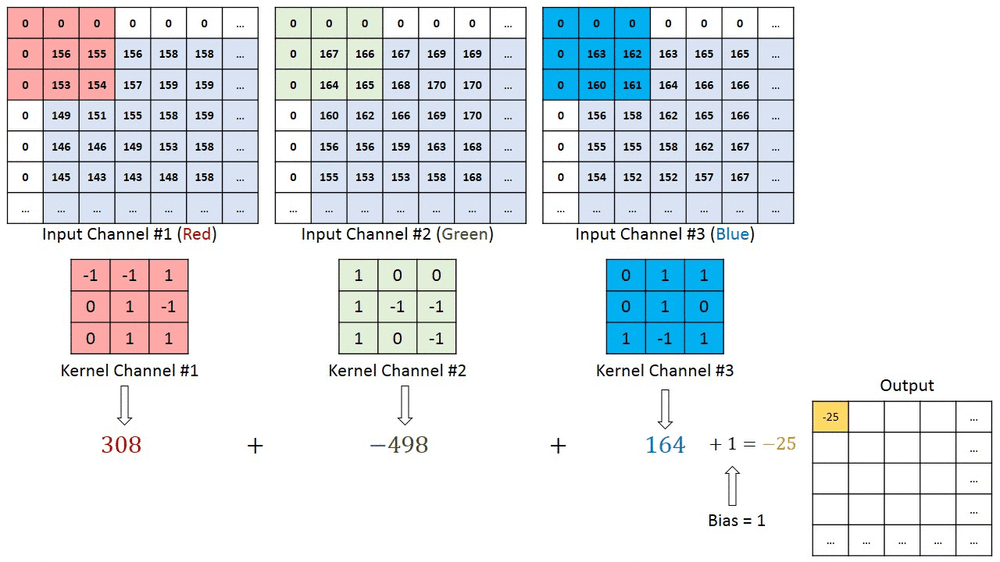
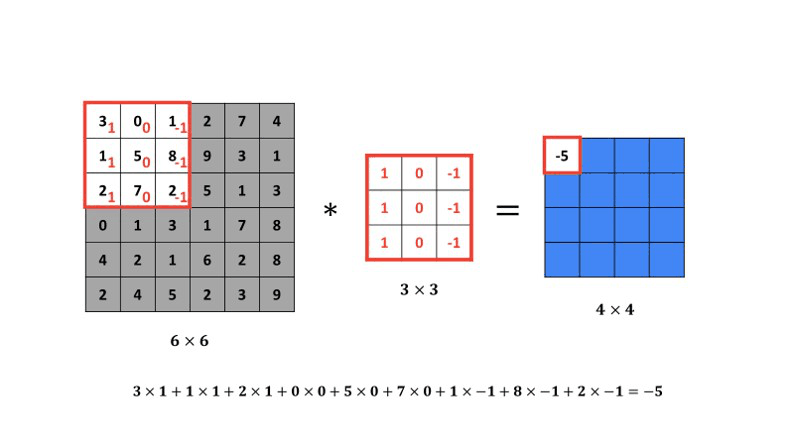
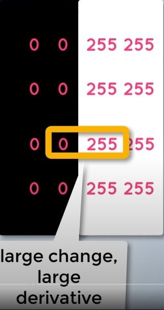
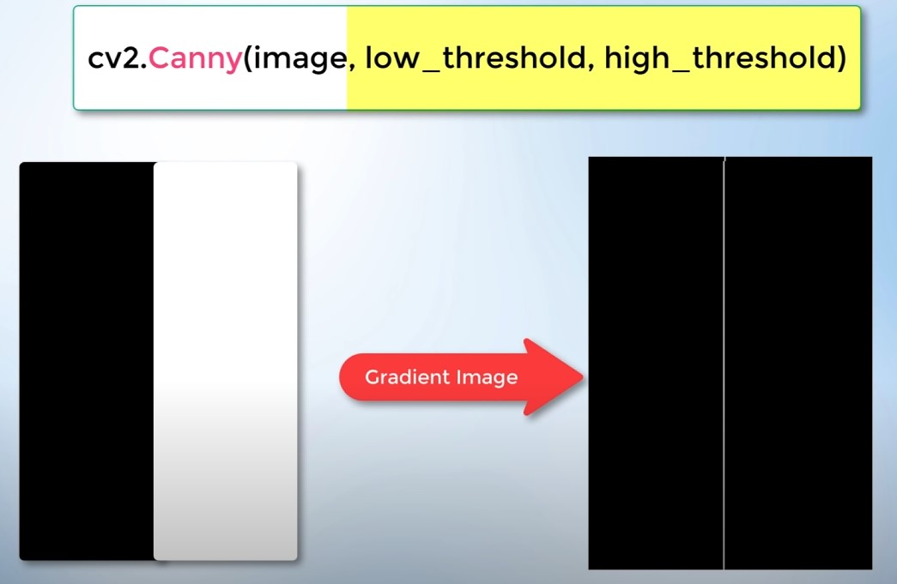
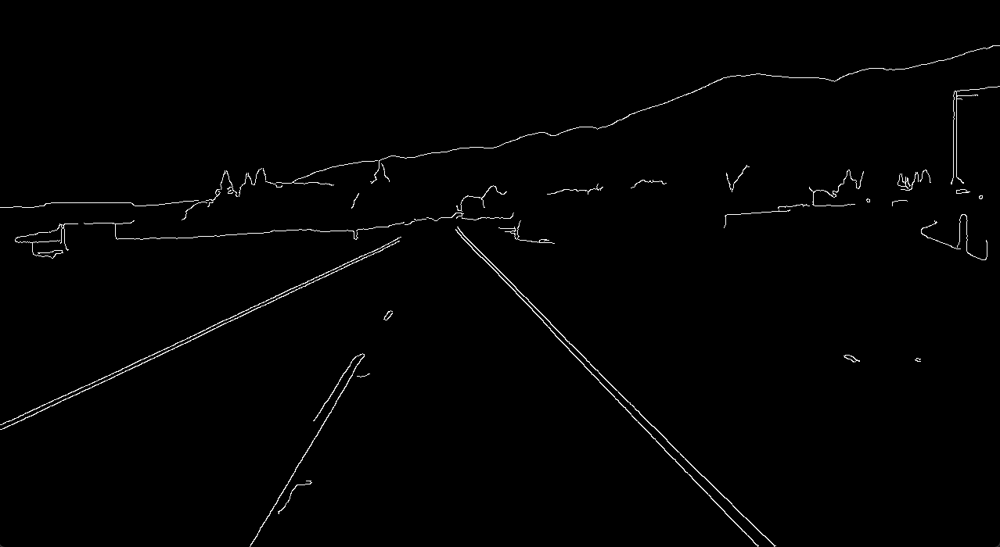
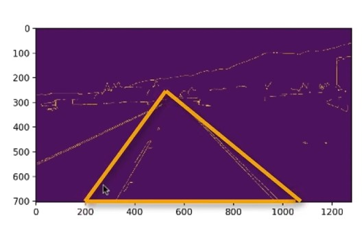

# Self Driving Car

## 1. Opencv
### 1.1 Gray

Since processing a 3-channel image will take a long time, we reduce the image to 1 channel.

The function we will use for this is:

```py
gray = cv2.cvtColor(lane_image, cv2.COLOR_RGB2GRAY)
```



## 1.2 GaussianBlur
Gaussian blur is used as a preprocessing step in many cases like canny edge detection.

Gaussian blur the image to reduce the amount of noise and remove speckles within the image. It is important to remove the very high frequency components that exceed those associated with the gradient filter used, otherwise, these can cause false edges to be detected.

```py
blur = cv2.GaussianBlur(gray, (5,5), 0)
```



## 1.3 Canny


Output:

```py
canny = cv2.Canny(blur, 50, 150)
```

## 1.4 Region of Interest

```py
def region_of_interest(image):
    height = image.shape[0]
    triangle = np.array([
        [(200, height), (1100, height), (550, 250)]
        ])
    mask = np.zeros_like(image)
    cv2.fillPoly(mask, triangle, 255)
    return mask
```



Output:

